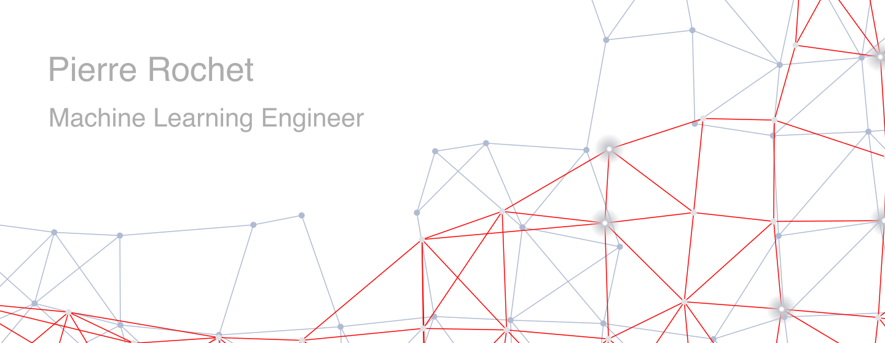

  
  
  

## Connect with me

  
  
  

## About me ✨

I do a lot of things around machine learning such as preparing
servers, training models, developing products or deploying services. I love to
explore new technologies and leverage them to solve real-life problems.

- 🔭 I’m currently working at [Orange Bank](https://www.orangebank.fr/) in Paris, France. 🇫🇷
- 🌱 I am currently improving my English.
- 😄 Pronouns: He / Him
- ⚡ Fun fact: I studied philosophy before learning programming.

## Some tools from my tech stack

<table>
<tr>
  <td align="center">
      
       
      git
  </td>
  <td align="center">
    
     
    python
  </td>
  <td align="center">
    
     
    conda
  </td>
  <td align="center">
    
     
    poetry
  </td>
  <td align="center">
    
     
    vscode
  </td>
  <td align="center">
      
     
    linux
  </td>
  <td align="center">
    
     
    fastapi
  </td>
</tr>
<tr>
  <td align="center">
    
     
    tensorflow
  </td>
  <td align="center">
    
     
    sklearn
  </td>
  <td align="center">
    
     
    pandas
  </td>
  <td align="center">
    
     
    numpy
  </td>
  <td align="center">
    
     
    transformers
  </td>
  <td align="center">
    
     
    mlflow
  </td>
  <td align="center">
    
     
    bentoml
  </td>
</tr>
<tr>
  <td align="center">
    
     
    aws
  </td>
  <td align="center">
    
     
    ansible
  </td>
  <td align="center">
    
     
    terraform
  </td>
  <td align="center">
    
     
    docker
  </td>
  <td align="center">
    
     
    kubernetes
  </td>
  <td align="center">
    
     
    jenkins
  </td>
  <td align="center">
    
     
    elasticsearch
  </td>
</tr>
</table>
