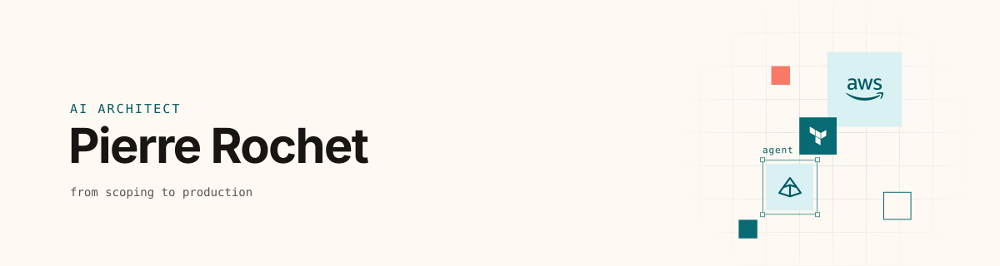

  <picture>
    <source media="(prefers-color-scheme: dark)" srcset="./img/banner-dark.svg">
    
  </picture>
  

  <em>I find where AI truly pays off, and I build what proves it.</em>
  

---

## About me ✨

I help companies scope, architect, and ship AI systems — RAG, LLM apps, and agents plugged into business data — and everything that keeps them running: evaluation, deployment, quality, and costs.

- 🔭 After seven years as a data & AI engineer, I've been working as an independent AI architect since 2025, in Paris, France 🇫🇷 and remote.
- 🌐 My website: [pierrerochet.com](https://pierrerochet.com)
- ✍️ I write about AI systems that survive production on my French-language blog: [Journal d'inférence](https://pierrerochet.com/blog)
- 💻 My favorite languages are Python and Go.
- 🌱 I'm currently improving my English.
- 😄 Pronouns: He / Him
- ⚡ Fun fact: I studied philosophy before learning programming.

## Some of my favorite tools

### DevOps

<table>
<tr>
  <td align="center">
    <a href="https://www.terraform.io/" target="_blank">
      <picture>
        <source media="(prefers-color-scheme: dark)" srcset="./img/icons/terraform-dark.svg">
        
      </picture>
    </a>
     
    terraform
  </td>
  <td align="center">
    <a href="https://www.docker.com/" target="_blank">
      <picture>
        <source media="(prefers-color-scheme: dark)" srcset="./img/icons/docker-dark.svg">
        
      </picture>
    </a>
     
    docker
  </td>
  <td align="center">
    <a href="https://grafana.com/" target="_blank">
      <picture>
        <source media="(prefers-color-scheme: dark)" srcset="./img/icons/grafana-dark.svg">
        
      </picture>
    </a>
     
    grafana
  </td>
  <td align="center">
    <a href="https://about.gitlab.com/stages-devops-platform/continuous-integration/" target="_blank">
      <picture>
        <source media="(prefers-color-scheme: dark)" srcset="./img/icons/gitlabci-dark.svg">
        
      </picture>
    </a>
     
    gitlabci
  </td>
</tr>
</table>

### Software Development

<table>
<tr>
  <td align="center">
    <a href="https://www.python.org/" target="_blank">
      <picture>
        <source media="(prefers-color-scheme: dark)" srcset="./img/icons/python-dark.svg">
        
      </picture>
    </a>
     
    python
  </td>
  <td align="center">
    <a href="https://fastapi.tiangolo.com/" target="_blank">
      <picture>
        <source media="(prefers-color-scheme: dark)" srcset="./img/icons/fastapi-dark.svg">
        
      </picture>
    </a>
     
    fastapi
  </td>
  <td align="center">
    <a href="https://docs.astral.sh/uv/" target="_blank">
      <picture>
        <source media="(prefers-color-scheme: dark)" srcset="./img/icons/uv-dark.svg">
        
      </picture>
    </a>
     
    uv
  </td>
  <td align="center">
    <a href="https://golang.org/" target="_blank">
      <picture>
        <source media="(prefers-color-scheme: dark)" srcset="./img/icons/go-dark.svg">
        
      </picture>
    </a>
     
    go
  </td>
</tr>
</table>

### Artificial Intelligence

<table>
<tr>
  <td align="center">
    <a href="https://www.langchain.com/langgraph" target="_blank">
      <picture>
        <source media="(prefers-color-scheme: dark)" srcset="./img/icons/langgraph-dark.svg">
        
      </picture>
    </a>
     
    langgraph
  </td>
  <td align="center">
    <a href="https://gofastmcp.com/" target="_blank">
      <picture>
        <source media="(prefers-color-scheme: dark)" srcset="./img/icons/fastmcp-dark.svg">
        
      </picture>
    </a>
     
    fastmcp
  </td>
  <td align="center">
    <a href="https://huggingface.co/" target="_blank">
      <picture>
        <source media="(prefers-color-scheme: dark)" srcset="./img/icons/transformers-dark.svg">
        
      </picture>
    </a>
     
    transformers
  </td>
  <td align="center">
    <a href="https://pytorch.org/" target="_blank">
      <picture>
        <source media="(prefers-color-scheme: dark)" srcset="./img/icons/pytorch-dark.svg">
        
      </picture>
    </a>
     
    pytorch
  </td>
</tr>
</table>

